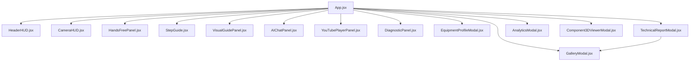
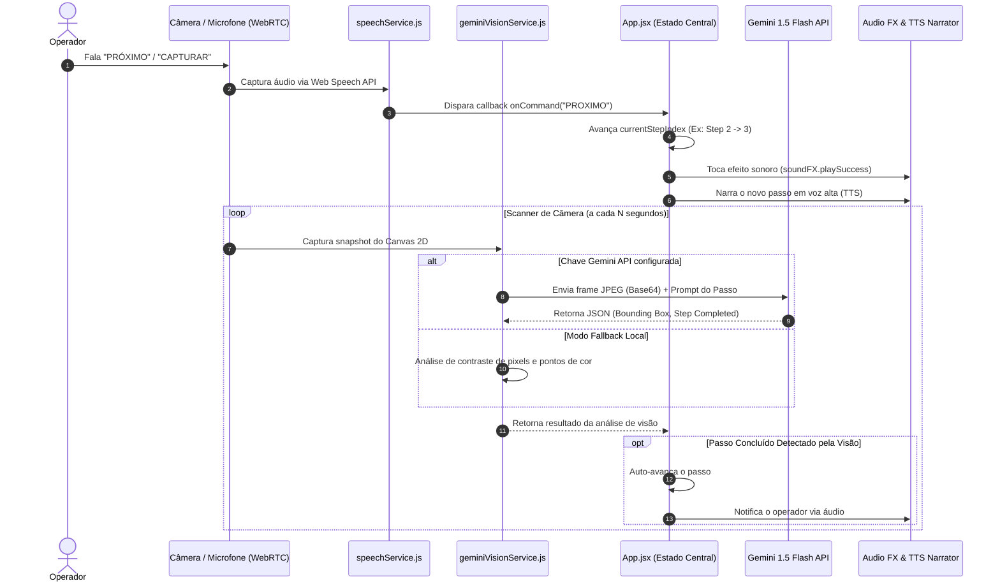
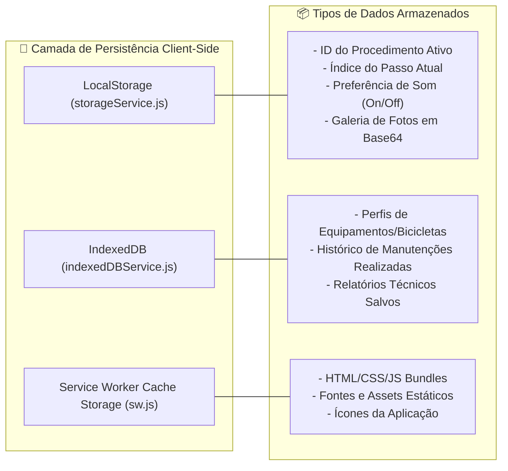

# 📐 Arquitetura do Sistema: Cyberdeck Workshop Assistant

Este documento descreve a arquitetura técnica, os fluxos de dados, a organização de componentes e os motores de IA/APIs do **Cyberdeck Workshop Assistant**.

---

## 🗺️ 1. Visão Geral da Arquitetura do Sistema (System Overview)

O aplicativo foi projetado como uma **Single Page Application (SPA)** *Offline-First* baseada em **React 19** e **Vite 8**, operando diretamente no navegador com consumo de APIs Nativas de baixo nível (WebRTC, Web Speech, Web Audio, IndexedDB) e integração com modelos de Inteligência Artificial Multimodal (**Google Gemini 1.5 Flash**).

```mermaid
graph TD
    subgraph CLIENT_BROWSER ["🌐 Navegador do Usuário (Client-Side)"]
        subgraph UI_LAYER ["💻 Camada de Interface (React 19 + Tailwind v4)"]
            App["App.jsx (Orquestrador de Estado Central)"]
            HUD["HUD Overhead (HeaderHUD, CameraHUD, HandsFreePanel)"]
            Panels["Painéis Laterais (StepGuide, VisualGuide, AIChat, YTPlayer)"]
            Modals["Modais de Apoio (Profile, Report, Analytics, 3DViewer, Gallery)"]
        end

        subgraph SERVICES_LAYER ["⚙️ Camada de Serviços & Motores"]
            SpeechEngine["speechService.js (STT SpeechRecognition + TTS SpeechSynthesis)"]
            AudioFXEngine["audioFX.js (Sintetizador Web Audio API)"]
            VisionEngine["geminiVisionService.js (Análise Multimodal & Pixel Contrast)"]
            LLMEngine["aiLLMService.js (Assistente Mecânico Gemini 1.5 Flash)"]
            DataEngine["indexedDBService.js & storageService.js (Persistência)"]
            ProcEngine["procedureImporter.js (Validador e Parser JSON)"]
        end

        subgraph BROWSER_APIS ["🔌 APIs Nativas do Navegador (Zero External Overhead)"]
            WebRTC["WebRTC (getUserMedia Câmera & Mic)"]
            SpeechAPI["Web Speech API (Reconhecimento PT-BR & Voz TTS)"]
            WebAudio["Web Audio API (Osciladores & Gain Nodes)"]
            MediaRecorder["MediaRecorder API (Gravação WebM)"]
            IDB["IndexedDB (Perfís e Histórico de Manutenção)"]
            PWAWorker["Service Worker (Cache de Assets Offline)"]
            Canvas2D["Canvas 2D / WebGL (Overlays AR & Bounding Boxes)"]
        end
    end

    subgraph CLOUD_SERVICES ["☁️ Serviços de IA em Nuvem"]
        GeminiAPI["Google Gemini API (gemini-1.5-flash)"]
    end

    %% Conexões UI -> Serviços
    App --> HUD
    App --> Panels
    App --> Modals
    
    HUD --> SpeechEngine
    HUD --> VisionEngine
    HUD --> AudioFXEngine

    Panels --> LLMEngine
    Modals --> DataEngine
    HeaderHUD --> ProcEngine

    %% Conexões Serviços -> APIs Nativas
    SpeechEngine --> SpeechAPI
    AudioFXEngine --> WebAudio
    VisionEngine --> Canvas2D
    HUD --> WebRTC
    HUD --> MediaRecorder
    DataEngine --> IDB
    App --> PWAWorker

    %% Conexões Serviços -> Cloud
    VisionEngine -.->|Frame Base64 + Key| GeminiAPI
    LLMEngine -.->|Prompt Técnico| GeminiAPI
```

---

## 🧩 2. Hierarquia de Componentes React (Component Tree)

O `App.jsx` gerencia centralizadamente o índice do passo atual, registro de procedimentos ativos, fotos capturadas e estados de modais, propagando props reativas para a árvore de componentes:

---

## 🔄 3. Fluxo de Controle Viva-Voz e Visão Computacional (Hands-Free Loop)

O ciclo de interatividade hands-free permite ao operador controlar o passo a passo tanto por comandos de voz quanto pela análise automática de imagem da câmera:

---

## 💾 4. Arquitetura de Persistência e Offline Data Management

O sistema utiliza estratégias de armazenamento em camadas no lado do cliente para permitir uso totalmente offline:

---

## 🛠️ 5. Matriz de Serviços e APIs Nativas Utilizadas

| Componente / Serviço | Tecnologias Utilizadas | Função Principal |
| :--- | :--- | :--- |
| **HeaderHUD.jsx** | React, Lucide, procedureImporter | Exibe status da sessão, atalhos de navegação, seletor de procedimentos e importador de manuais JSON. |
| **CameraHUD.jsx** | WebRTC, Canvas 2D, MediaRecorder | Exibe feed da câmera com retículo AR, gravações de vídeo WebM e captura de fotos com overlay. |
| **HandsFreePanel.jsx** | Web Speech API (SpeechRecognition) | Transcreve a fala do operador em tempo real e reconhece comandos PT-BR. |
| **speechService.js** | Web Speech API (SpeechSynthesis) | Síntese de voz TTS com regulador de velocidade (0.7x a 1.5x) para narração dos passos. |
| **audioFX.js** | Web Audio API | Sintetizador de efeitos sonoros futuristas (cliques, alertas, sucesso, bips do manômetro). |
| **geminiVisionService.js**| Gemini 1.5 Flash API + HTML5 Canvas | Reconhecimento de peças e verificação de conclusão de passo por imagem. |
| **aiLLMService.js** | Gemini 1.5 Flash API | Assistente especialista em mecânica de oficina com sugestões de tutoriais do YouTube. |
| **indexedDBService.js**| IndexedDB API | Gerenciamento de banco de dados local para perfis de equipamentos e registros de manutenção. |

---

> 🚀 **Nota de Manutenibilidade**: Todos os diagramas nesta documentação utilizam a sintaxe nativa **Mermaid.js**, podendo ser visualizados diretamente no GitHub, VS Code ou Antigravity.
