# 🚲 Cyberdeck Workshop Assistant (Hands-Free Workshop Guide, AR & AI Specialist)

Um aplicativo web estilo **Cyberdeck HUD futurista** com **Assistente de Oficina Viva-Voz**, projetado para orientar o operador passo a passo em procedimentos de manutenção física (Calibragem de Pneus de Bicicleta, Montagem de SSDs em Notebooks, Lubrificação de Corrente, e Procedimentos Personalizados em JSON), acompanhado por câmera WebRTC com overlays AR, vídeo explicativo HD, **Visualizador 3D 360°**, **Gravador de Vídeo WebM**, **Relatórios em PDF** e **IA Especialista em Mecânica (LLM)**.

---

## 🌟 Funcionalidades do Estado da Arte

- 📱 **Progressive Web App (PWA) Offline-First**: Suporte completo a funcionamento sem internet via `sw.js` e `manifest.json`.
- 🎙️ **Controle Viva-Voz por Voz (`Web Speech API`)**: Comandos de voz em Português (`"PRÓXIMO"`, `"VOLTAR"`, `"CAPTURAR"`, `"REPETIR"`, `"AJUDA"`, `"REINICIAR"`), narração TTS e **Controle Deslizante de Velocidade da Voz da IA** (0.7x a 1.5x).
- 👁️ **Visão Computacional IA ao Vivo (Gemini 1.5 Flash)**: Scanner de câmera em tempo real que enquadra peças, detecta erros e avança os passos sozinho!
- 📹 **Câmera WebRTC com Overlays AR**: Retículos de mira para válvulas, sensores de sensibilidade e **Manômetro Circular Digital de PSI**.
- 🎥 **Gravador de Vídeo de Sessão (`MediaRecorder API`)**: Grave a sessão de manutenção direto no HUD da câmera e baixe o vídeo em formato `.webm` com um clique.
- 📐 **Visualizador 3D Interativo 360°**: Inspeção tridimensional em 360° de válvulas Presta/Schrader e cartões SSD NVMe com rotação livre e zoom.
- 📂 **Importador & Exportador de Manuais em JSON**: Carregue procedimentos customizados `.json` para qualquer tarefa de oficina.
- 📄 **Gerador de Relatórios Técnicos Oficiais em PDF**: Emissão de relatórios assinados com data, carimbo de horas, fotos da câmera, dados de pressão e marcas de verificação.
- 💾 **Banco de Dados Local `IndexedDB`**: Salvamento de perfis de bicicletas e histórico de manutenções diretamente no navegador.
- 📊 **Dashboard Analytics de Oficina**: Métricas de tempo médio, procedimentos concluídos e estatísticas de uso.
- 🎬 **Painel de Vídeo Explicativo Anamórfico HD**: Animações técnicas vetoriais de cada etapa com suporte a Câmera Lenta (`0.5x`, `1x`, `2x`).
- 🤖 **Assistente IA Especialista de Mecânica (LLM)**: Tire dúvidas sobre calibragem, bombas, torques e componentes com indicação de tutoriais do YouTube.

---

## 🗺️ Arquitetura e Gráfico de Dependências

```mermaid
graph TD
    Root["App.jsx (Ponto Central)"]

    subgraph PRODUCTION_STACK ["📦 Pilha de Produção (NPM)"]
        React["React v19"]
        Vite["Vite v8"]
        Lucide["Lucide-React"]
        Tailwind["Tailwind CSS v4"]
    end

    subgraph UI_COMPONENTS ["💻 Componentes da Interface"]
        HeaderHUD["HeaderHUD.jsx"]
        CameraHUD["CameraHUD.jsx"]
        HandsFreePanel["HandsFreePanel.jsx"]
        StepGuide["StepGuide.jsx"]
        VisualGuide["VisualGuidePanel.jsx"]
        AIChat["AIChatPanel.jsx"]
        YTPlayer["YouTubePlayerPanel.jsx"]
        Diagnostic["DiagnosticPanel.jsx"]
        Gallery["GalleryModal.jsx"]
        ProfileModal["EquipmentProfileModal.jsx"]
        ReportModal["TechnicalReportModal.jsx"]
        AnalyticsModal["AnalyticsModal.jsx"]
        Viewer3D["Component3DViewerModal.jsx"]
    end

    subgraph SERVICES ["⚙️ Serviços & Motores"]
        GeminiVision["geminiVisionService.js"]
        AILLM["aiLLMService.js"]
        AudioFX["audioFX.js"]
        SpeechSvc["speechService.js"]
        StorageSvc["storageService.js"]
        IndexedDB["indexedDBService.js"]
        ProcImporter["procedureImporter.js"]
        ProcData["proceduresData.js"]
    end

    subgraph NATIVE_APIS ["🌐 APIs Nativas do Navegador (0 KB)"]
        WebRTC["WebRTC Câmera & Mic"]
        SpeechRec["SpeechRecognition (Voz PT-BR)"]
        SpeechSynth["SpeechSynthesis (Narrador TTS)"]
        MediaRec["MediaRecorder API (Gravador WebM)"]
        IndexedDBAPI["IndexedDB (Banco de Dados Local)"]
        ServiceWorker["Service Worker PWA (Cache Offline)"]
        Canvas2D["HTML5 Canvas 2D / 3D WebGL"]
    end

    Root --> HeaderHUD
    Root --> CameraHUD
    Root --> HandsFreePanel
    Root --> StepGuide
    Root --> VisualGuide
    Root --> AIChat
    Root --> YTPlayer
    Root --> Diagnostic
    Root --> Gallery
    Root --> ProfileModal
    Root --> ReportModal
    Root --> AnalyticsModal
    Root --> Viewer3D

    CameraHUD --> MediaRec
    CameraHUD --> GeminiVision
    CameraHUD --> Canvas2D

    HeaderHUD --> ProcImporter
    ProfileModal --> IndexedDB
    AnalyticsModal --> IndexedDB
    ReportModal --> Gallery

    HandsFreePanel --> SpeechRec
    HandsFreePanel --> SpeechSvc
    SpeechSvc --> SpeechSynth

    VisualGuide --> Viewer3D
```



---

## 🛠️ Tecnologias Utilizadas

- **Core**: React 19 + Vite 8 (JavaScript ES6+)
- **Estilização**: Tailwind CSS v4 + Vanilla CSS Cyberpunk Design System
- **Ícones**: Lucide React
- **Nativa Browser APIs**:
  - `PWA Service Worker & Manifest` (Cache Offline completo)
  - `IndexedDB` (Banco de dados de perfis e histórico)
  - `MediaRecorder API` (Gravação de vídeo WebM)
  - `Web Speech API` (Reconhecimento de Fala PT-BR & Síntese de Voz TTS)
  - `WebRTC getUserMedia` (Câmera & Microfone)
  - `Web Audio API` (Sintetizador de Efeitos Sonoros HUD)

---

## 🚀 Como Executar Localmente

1. **Clonar o repositório**:
   ```bash
   git clone https://github.com/rcruzjs/cyberdeck-workshop-assistant.git
   cd cyberdeck
   ```

2. **Instalar as dependências**:
   ```bash
   npm install
   ```

3. **Iniciar o servidor de desenvolvimento**:
   ```bash
   npm run dev
   ```
   Acesse no navegador: `http://localhost:5173/`

4. **Gerar build de produção**:
   ```bash
   npm run build
   ```
