# 🚲 Cyberdeck Workshop Assistant (Hands-Free Bike Tire Guide & AI Specialist)

Um aplicativo web estilo **Cyberdeck HUD futurista** com **Assistente de Oficina Viva-Voz**, projetado para orientar o usuário passo a passo no procedimento de enchimento e calibragem de pneus de bicicleta, acompanhado por câmera WebRTC com overlays AR, vídeo explicativo anamórfico e **IA Especialista em Mecânica (LLM)**.

---

## 🌟 Funcionalidades Principais

- 🎙️ **Controle Viva-Voz por Voz (`Web Speech API`)**: Comandos de voz em Português (`"PRÓXIMO"`, `"VOLTAR"`, `"CAPTURAR"`, `"REPETIR"`, `"AJUDA"`, `"REINICIAR"`) e Narração TTS audível.
- 👁️ **Visão Computacional IA ao Vivo (Gemini 1.5 Flash)**: Scanner de câmera em tempo real que enquadra a roda, localiza a válvula Presta/Schrader, detecta erros e avança os passos sozinho!
- 📹 **Câmera WebRTC com Overlays AR**: Retículos de mira para válvula Presta/Schrader, alavanca de bomba e **Manômetro Circular Digital de PSI**.
- 🎬 **Painel de Vídeo Explicativo Anamórfico HD**: Animações técnicas vetoriais de cada etapa com suporte a Câmera Lenta (`0.5x`, `1x`, `2x`).
- 🤖 **Assistente IA Especialista de Mecânica (LLM)**: Tire dúvidas sobre calibragem de pneus tubulares (110-160 PSI), tubeless (22-35 PSI), bombas e manutenção.
- 📺 **Player de Vídeo YouTube da IA**: Carregamento dinâmico de tutoriais em vídeo do YouTube determinados pela IA.
- 📊 **Painel de Diagnóstico do Pneu**: Medição de PSI/Bar e teste de taxa de vazamento (`0.0 PSI/min`).
- 📸 **Galeria & Registro Fotográfico**: Emissão de relatório e certificado de manutenção com capturas de tela.

---

## 🗺️ Arquitetura e Gráfico de Dependências

```mermaid
graph TD
    Root["App.jsx (Ponto Central)"]

    subgraph PRODUCTION_STACK ["📦 Pilha de Produção (NPM)"]
        React["React v19.3"]
        ReactDOM["React-DOM v19.3"]
        Lucide["Lucide-React (Ícones)"]
    end

    subgraph UI_COMPONENTS ["💻 Componentes da Interface"]
        HeaderHUD["HeaderHUD.jsx"]
        CameraHUD["CameraHUD.jsx"]
        HandsFreePanel["HandsFreePanel.jsx"]
        StepGuide["StepGuide.jsx"]
        VisualGuide["VisualGuidePanel.jsx"]
        AIChat["AIChatPanel.jsx"]
        YTPlayer["YouTubePlayerPanel.jsx"]
        Diagnostic["DiagnosticPanel.jsx"]
        Gallery["GalleryModal.jsx"]
    end

    subgraph SERVICES ["⚙️ Serviços & Motores"]
        GeminiVision["geminiVisionService.js"]
        AILLM["aiLLMService.js"]
        AudioFX["audioFX.js"]
        SpeechSvc["speechService.js"]
        StepsData["stepsData.js"]
    end

    subgraph NATIVE_APIS ["🌐 APIs Nativas do Navegador (0 KB)"]
        WebRTC["WebRTC (Câmera & Mic)"]
        SpeechRec["SpeechRecognition (Voz PT-BR)"]
        SpeechSynth["SpeechSynthesis (Narrador TTS)"]
        WebAudio["Web Audio API (Sintetizador)"]
        Canvas2D["HTML5 Canvas 2D (Retículos AR)"]
    end

    Root --> HeaderHUD
    Root --> CameraHUD
    Root --> HandsFreePanel
    Root --> StepGuide
    Root --> VisualGuide
    Root --> AIChat
    Root --> YTPlayer
    Root --> Diagnostic
    Root --> Gallery

    CameraHUD --> Lucide
    CameraHUD --> Canvas2D
    CameraHUD --> WebRTC
    CameraHUD --> GeminiVision

    HandsFreePanel --> SpeechRec
    HandsFreePanel --> WebAudio

    AIChat --> SpeechSynth
    AIChat --> AILLM
    AIChat --> YTPlayer

    VisualGuide --> Canvas2D
    Diagnostic --> AudioFX
```



---

## 🛠️ Tecnologias Utilizadas

- **Core**: React + Vite (JavaScript ES6+)
- **Estilização**: Tailwind CSS v4 + Vanilla CSS Cyberpunk Design System
- **Ícones**: Lucide React
- **Nativa Browser APIs**:
  - `Web Speech API` (Reconhecimento de Fala PT-BR & Síntese de Voz TTS)
  - `WebRTC getUserMedia` (Câmera & Microfone)
  - `Web Audio API` (Sintetizador de Efeitos Sonoros HUD)

---

## 🚀 Como Executar Localmente

1. **Clonar o repositório**:
   ```bash
   git clone https://github.com/rcruzjs/cyberdeck-workshop-assistant.git
   cd cyberdeck
   ```

2. **Instalar as dependências**:
   ```bash
   npm install
   ```

3. **Iniciar o servidor de desenvolvimento**:
   ```bash
   npm run dev
   ```
   Acesse no navegador: `http://localhost:5173/`

4. **Gerar build de produção**:
   ```bash
   npm run build
   ```
